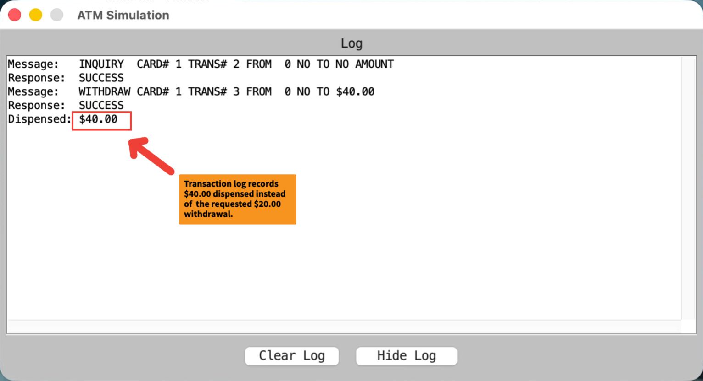

>   **SENG 637 - Software Testing, Reliability, and Quality**

**Lab. Report \#1 – Introduction to Testing and Defect Tracking**

| Group: 5     |
|-----------------|
| Kwesi |   
| Zhanzhi |   
| Lawrence |   
| Joe |   

**Table of Contents**

[1 Introduction](#Introduction)

[2 High-level description of the exploratory testing plan](#high-level-description-of-the-exploratory-testing-plan)

[3 Comparison of exploratory and manual functional testing](#comparison-of-exploratory-and-manual-functional-testing)

[4 Notes and discussion of the peer reviews of defect reports](#notes-and-discussion-of-the-peer-reviews-of-defect-reports)

[5 How the pair testing was managed and team work/effort was
divided](#how-the-pair-testing-was-managed-and-team-workeffort-was-divided)

[6 Difficulties encountered, challenges overcome, and lessons
learned](#difficulties-encountered-challenges-overcome-and-lessons-learned)

[7 Comments/feedback on the lab and lab document itself](#Commentsfeedback-on-the-lab-and-lab-document-itself)

# Introduction

In this lab, we explored various testing methods applied to an ATM system. Specifically, the lab focused on exploratory testing,manual functional (scripted) testing, and regression testing. Prior to this, exploratory testing was understood as an approach where software testers actively explore the system without predefined scripts, discovering defects as they interact with the system in real-time. Manual functional testing, on the other hand, was seen as a more structured, pre-scripted approach, aiming to validate system functions according to predefined criteria. Regression testing was anticipated as a means to ensure that previously identified bugs are fixed and that new changes don't negatively affect the system.

# High-level description of the exploratory testing plan

The exploratory testing phase was structured around the idea of actively exploring different transaction functionalities within the ATM system. We freely explored the system's behavior with minimal guidelines, which allowed for a broad coverage of the system's features, ranging from basic operations like withdrawals,fund transfers, balance inquiries and deposits to more complex scenarios like handling invalid card entries. Each group member was assigned a specific area to focus on, ensuring a wide spread of testing across the ATM system.

# Comparison of exploratory and manual functional testing

Exploratory testing allowed us to leverage the creativity to uncover defects that might not have been anticipated by manual functional (scripted) testing. This method proved highly effective for catching edge cases and system behaviours under non-standard conditions. For instance, a defect was found where the system displayed "insufficient cash available" despite the balance not being exceeded during a withdrawal request(e.g., Bug A1G5-14).
Also during our exploratory tests, we found issues that weren’t initially anticipated in the test cases, such as the incorrect display of balances and mismatches in transaction logs (e.g., Bug A1G5-10, where a withdrawal of $20 resulted in a withdrawal of $40 instead).
 

In contrast, manual functional testing followed a set of predefined test scripts, focusing on validating specific functionalities as outlined in the test cases in appendix C. This included testing operations like session,system startup and shutdown,fund transfer,withdrawals,invalid pin extensions, and deposits based on expected inputs and outcomes. The advantage of manual functional testing is its repeatability, which ensures that each functionality is thoroughly checked against a fixed criterion. However, it lacks the flexibility of exploratory testing, which can uncover issues that scripted tests might overlook.

# Notes and discussion of the peer reviews of defect reports

Peer reviews played a crucial role in ensuring the accuracy of defect reports and the thoroughness of the testing process. Each defect identified by one tester was reviewed by another to verify its validity and impact. For instance, the issue regarding the system displaying an incorrect receipt after a transfer was flagged, and its investigation ensured that the underlying issue with transaction recording was noted.

For example, Bug A1G5-25, which involved a situation where the ATM attempted to perform a withdrawal instead of a balance inquiry, was flagged as a critical bug that could lead to significant user frustration. The importance of clear descriptions and steps to reproduce was also emphasized to ensure that developers could easily replicate and address the issues.

# How the pair testing was managed and team work/effort was divided 

The team was divided into two pairs, with four members in total. Within each pair, one member conducted the testing while the other reviewed and analyzed the results. Peer reviews were conducted to evaluate defect reports. Regression testing was conducted individually, with each member responsible for a similar number of defect reports and scripted test cases to ensure an even distribution of effort.

## Work distribution

|            | **Members**      | **Exploratory Testing**                      | **Manual Scripted Testing** |
| ---------- | ---------------- | -------------------------------------------- | --------------------------- |
| **Pair A** | Zhanzhi, Joe     | System Startup/Shutdown, Transaction, Withdrawal, Deposit | Test case 1-20              |
| **Pair B** | Lawrence, Kwesi  | Session, Invalid PIN, Transfer, Inquiry      | Test case 21-40             |

# Difficulties encountered, challenges overcome, and lessons learned

Some challenges included identifying edge cases and unexpected behavior, such as the ATM system crashing after entering a very long PIN (e.g, Bug A1G5-16). It was also difficult to reproduce certain issues due to varying system states.

We also paid attention to the ATM logging system to fully understand the workings of the ATM machine as well as being attentive to details,enabled us to discover certain unexpected behaviours.

The key lesson learned was the importance of clear, consistent test procedures and a structured approach to defect reporting as well as the various testing processes such as exploratory,manual functional testing as well as regression testing enables us to eventually build a more rigorous ATM system and minimize serious bugs that affect software quality and reliability. Exploratory testing, while effective in finding unexpected issues, required a more flexible approach and a willingness to adapt to the system's feedback.

# Comments/feedback on the lab and lab document itself
The lab provided valuable insight into both manual functional testing and exploratory testing methodologies. One major takeaway was how each testing method complemented the other. While manual testing helped verify known functional requirements, exploratory testing allowed us to uncover more obscure issues that could be missed otherwise.
This lab was also very useful in providing our group with extensive knowledge and the practical understanding of the concepts in software testing and how to create effective bug reports. It also gave us experience in using defect tracking tools like Jira.

